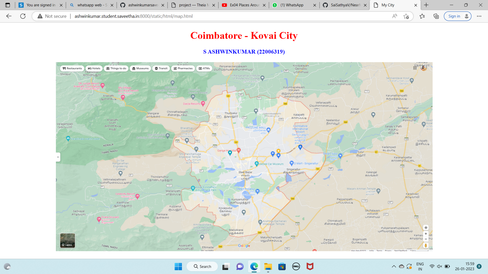
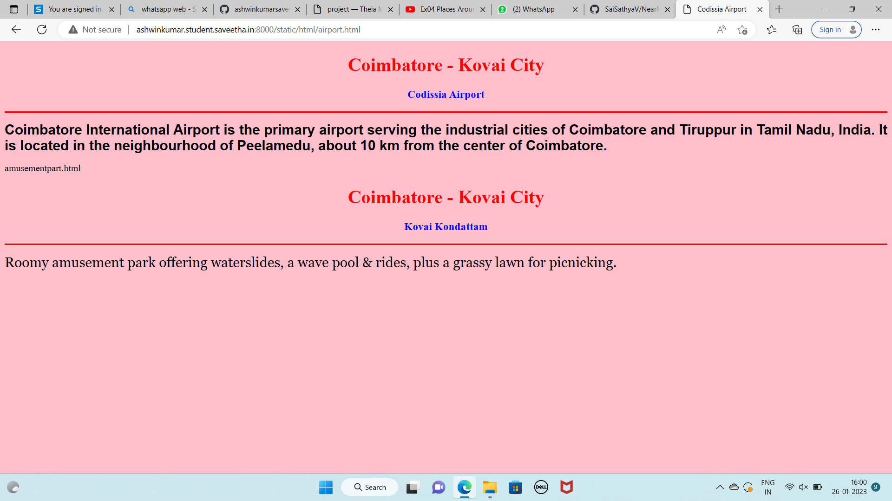
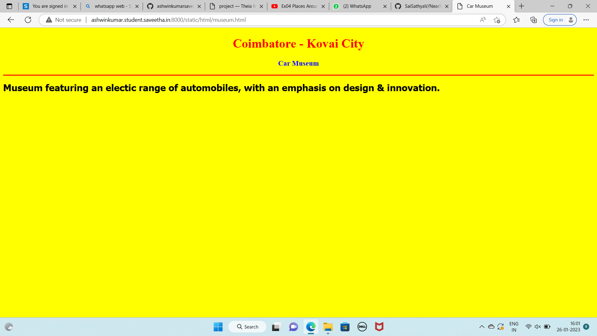
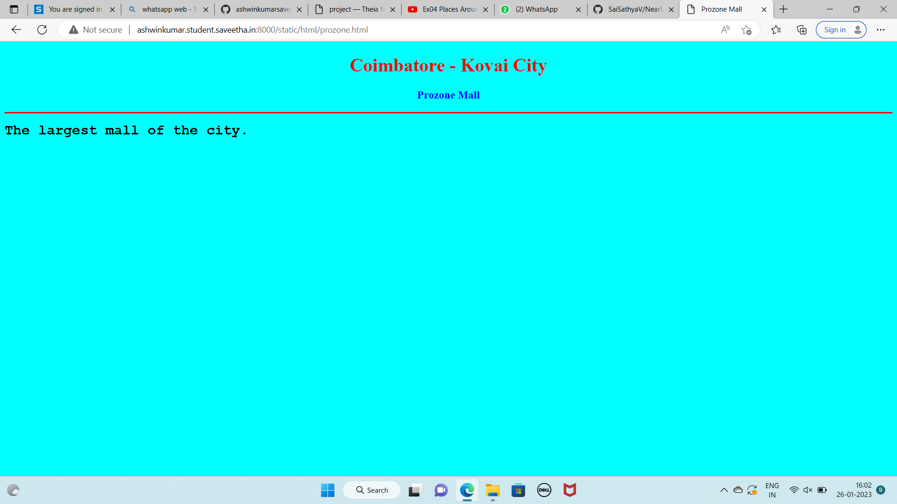
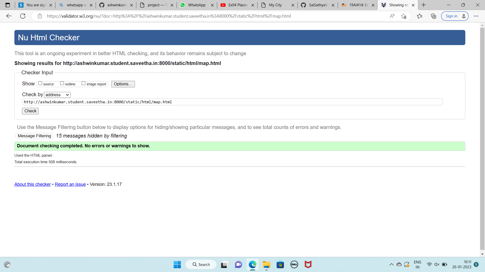

# Places Around Me
## AIM:
To develop a website to display details about the places around my house.

## Design Steps:

### Step 1:
Clone the git repository into Theia IDE.

### Step 2:
Create a new Django project.

### step 3:
Write the needed HTML code.

### step 4:
Run the Django server and execute the HTML files.

## Code:
 ```
 map.html

<!DOCTYPE html>
<html lang="en">
<head>
<title>My City</title>
</head>
<body>
<h1 align="center">
<font color="red"><b>Coimbatore - Kovai City</b></font>
</h1>
<h3 align="center">
<font color="blue"><b>Sai Sathya V (22008626)</b></font>
</h3>
<center>

<map name="MyCity">
<area shape="circle" coords="783,265,50" href="/static/html/airport.html" title="Codissia Airport">
<area shape="rectangle" coords="600,200,750,265" href="/static/html/prozone.html" title="Prozone Mall">
<area shape="circle" coords="495,420,53" href="/static/html/amusementpark.html" title="Kovai Kondattam">
<area shape="circle" coords="630,350,50" href="/static/html/museum.html" title="Car Museum">
<area shape="rectangle" coords="430,285,395,395" href="/static/html/temple.html" title="Sri Anjaneya Temple">
</map>
</center>
</body>
</html>


airport.html
<!DOCTYPE html>
<html lang="en">
<head>
<title>Codissia Airport</title>
</head>
<body bgcolor="pink">
<h1 align="center">
<font color="red"><b>Coimbatore - Kovai City</b></font>
</h1>
<h3 align="center">
<font color="blue"><b>Codissia Airport</b></font>
</h3>
<hr size="3" color="red">
<p align="justify">
<font face="Arial" size="5">
<b>
Coimbatore International Airport is the primary airport serving the industrial cities of Coimbatore and Tiruppur in Tamil Nadu, India. It is located in the neighbourhood of Peelamedu, about 10 km from the center of Coimbatore.
</b>
</font>
</p>
</body>
</html>

amusementpart.html

<!DOCTYPE html>
<html lang="en">
<head>
<title>Kovai Kondattam</title>
</head>
<body bgcolor="lime">
<h1 align="center">
<font color="red"><b>Coimbatore - Kovai City</b></font>
</h1>
<h3 align="center">
<font color="blue"><b>Kovai Kondattam</b></font>
</h3>
<hr size="3" color="red">
<p align="justify">
<font face="Georgia" size="5">
Roomy amusement park offering waterslides, a wave pool & rides, plus a grassy lawn for picnicking.
</font>
</p>
</body>
</html>


museum.html

<!DOCTYPE html>
<html lang="en">

<head>
    <title>Car Museum</title>
</head>

<body bgcolor="yellow">
    <h1 align="center">
        <font color="red"><b>Coimbatore - Kovai City</b></font>
    </h1>
    <h3 align="center">
        <font color="blue"><b>Car Museum</b></font>
    </h3>
    <hr size="3" color="red">
    <p align="justify">
        <font face="Tahoma" size="5">
            <b>
                Museum featuring an electic range of automobiles, with an emphasis on design & innovation.
            </b>
        </font>
    </p>
</body>

</html>

prozone.html

<!DOCTYPE html>
<html lang="en">
<head>
<title>Prozone Mall</title>
</head>
<body bgcolor="cyan">
<h1 align="center">
<font color="red"><b>Coimbatore - Kovai City</b></font>
</h1>
<h3 align="center">
<font color="blue"><b>Prozone Mall</b></font>
</h3>
<hr size="3" color="red">
<p align="justify">
<font face="Courier New" size="5">
<b>
The largest mall of the city.
</b>
</font>
</p>
</body>
</html>

temple.html

<!DOCTYPE html>
<html lang="en">
<head>
<title>Sri Anjaneya Temple</title>
</head>
<body bgcolor="orange">
<h1 align="center">
<font color="red"><b>Coimbatore - Kovai City</b></font>
</h1>
<h3 align="center">
<font color="blue"><b>Sri Anjaneya Temple</b></font>
</h3>
<hr size="3" color="red">
<p align="justify">
<font face="Georgia" size="5">
Sri Anjaneya Temple known as Panchamuga Anjaneyar Temple is one attractions of  popular tourist spot.This temple is dedicated to Lord Hanuma in the divine form of Panchamuga Anjaneyar.Here is Some Fact of Sri Anjaneya Temple near Eachanari Coimbatore Tamil Nadu.
</font>
</p>
</body>
</html>
```

## Output:









## HTML VALIDATOR


## Result:
The program for implementing image map is executed successfully.